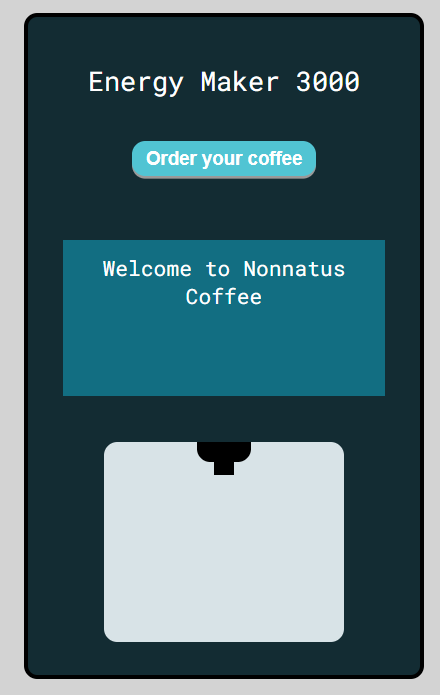
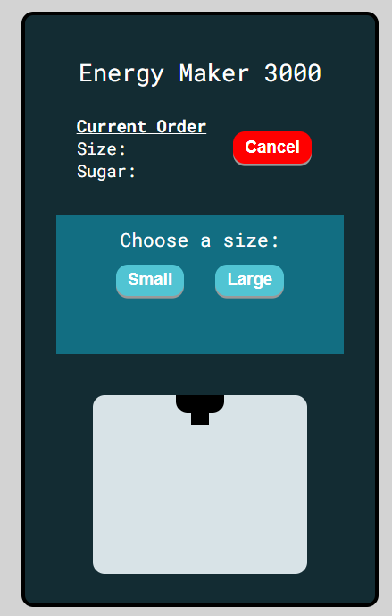
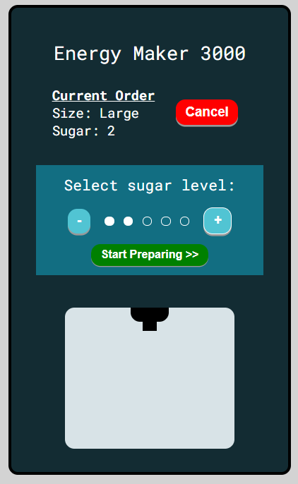
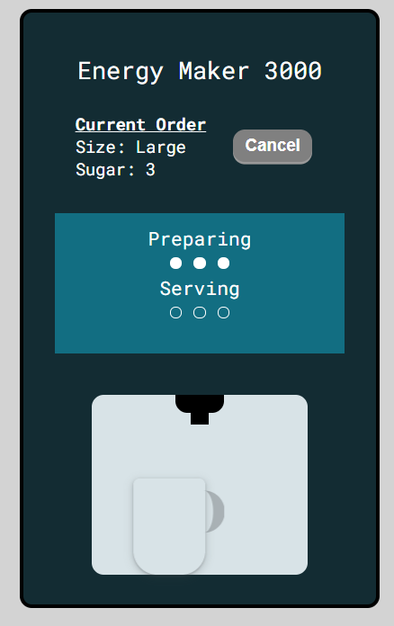
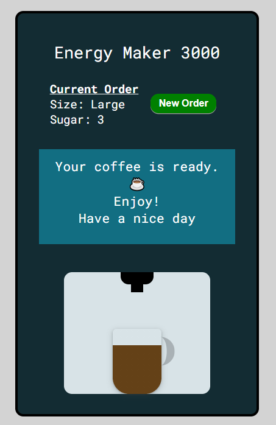

# Nonnatus Coffee

You can order a coffee from this machine, select size and sugar level.
Just wait a few seconds and enjoy!
Power up with the best coffee in town.


## Technologies used

Built with Vanilla JS and CSS

## How to use

- Start your order
- Select a size
- Select the sugar level you desire
- Click on Start Preparation (Once the preparation starts the order cannot be canceled)
- Wait for your beverage to be ready
- Enjoy!

  
## Demo

This application is deployed at https://nonnatus-coffee.vercel.app/


## Screenshots



<br/>


  
## Run Locally

You can clone the project and run it on your own computer. Make the changes you want.

```bash
  git clone https://github.com/iqrivas/nonnatus-coffee.git
```

Go to the project directory

```bash
  cd nonnatus-coffee
```

*No need to install dependencies. Just open the index.html file in your browser.

## Project Developed as part of Platzi Master:

- Created by Denisse Rivas [Github](https://github.com/iqrivas) | [LinkedIn](https://www.linkedin.com/in/iqrivas/) 
- Frontend Focus | Slack: DenisseRivas
- Assigned by: Platzi Master Coach - Ana Belisa Martinez

